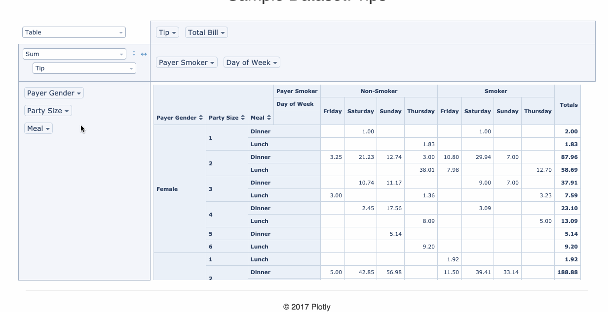

# react-sort-pivottable

## Intro

This repo is forked from [react-pivottable](https://github.com/plotly/react-pivottable#react-pivottable) and has made some improvements. You can refer to original repo to see how to use this component.

## Changelog

- v0.10.1: Add sort function to rows and cols
- v0.10.2: 
  - Add fixed header function
  - Update sort icon style

## 2020-07-28

Now it has the ability to sort columns and rows. Since it's not like normal tables so from code-side I checked, here's the cols and rows defined:


So the sort function works like this:

- only cols:


- only rows:


- cols and rows:

**Note: In this case, only one dimension works because of the order logic.Row sort will cancel col sort and vice versa**


## How to use

Install it and follow the origin guide

```
npm install react-sort-pivottable
```


It's very easy to enable sort function, it provides two props to let you choose what dimension to apply：

- `enableRowSort`: control row sort
- `enableColSort`: control column sort

You can check the code in `examples/App.jsx` to find the use case, try to toggle the value to see what happens.

## 2020-08-28

Now it has a fixed table header ! It provided a function inside src/Utilities.js which called `stickHeader`，it directly manipulates DOM elements and uses `sticky` attribute to make it work. It's very easy to use, just called this function inside a `setTimeout`  callback，for example：

```js
componentDidMount() {
    setTimeout(() => {
        stickHeader()
    }, 0);
}
```




You can check `examples/App.jsx` to see how to use it !

> The reason I didn't add fixed cols is that pivot table is too dynamic, sometimes the cols can be a lot and will bring the question: which part should be on top if the cols take over the whole screen width, the fixed part or the scrolled part ? If it's the fixed part, the data area wouldn't be displayed, if it's the scrolled part, the fixed part wouldn't be fixed anymore. 

Besides，this version also change the sort icon style. It used the same font （▾）as the one in the selector but doesn't look well，so it's replaced by the new CSS icons.
