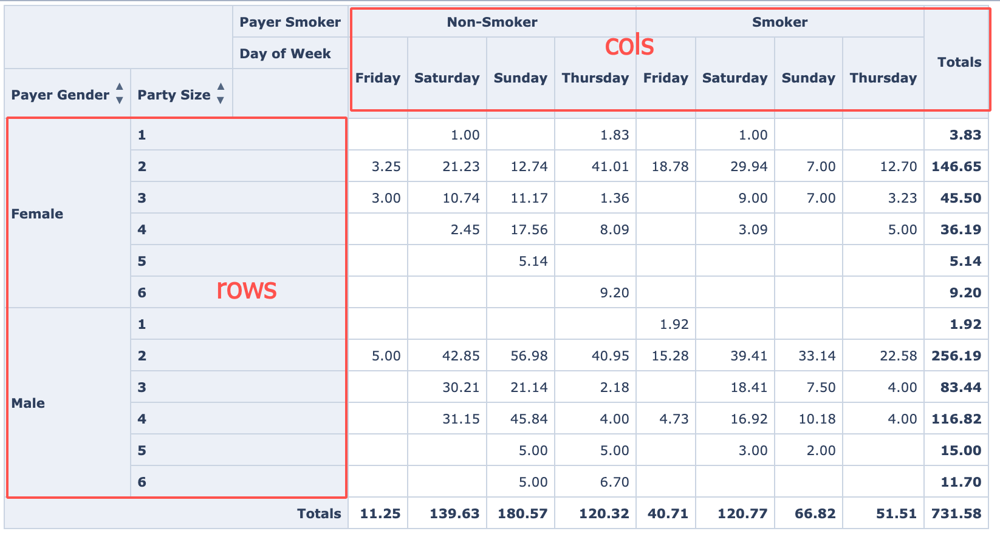
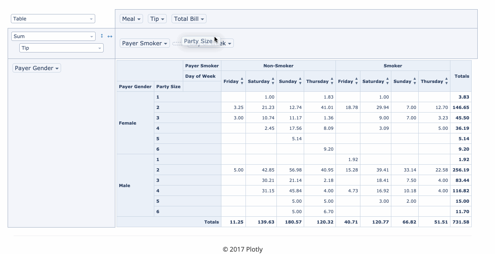
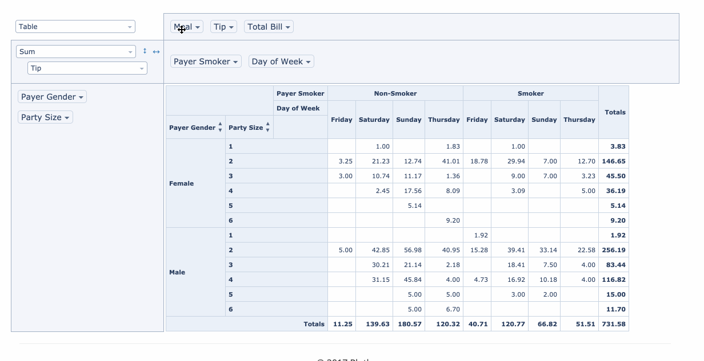
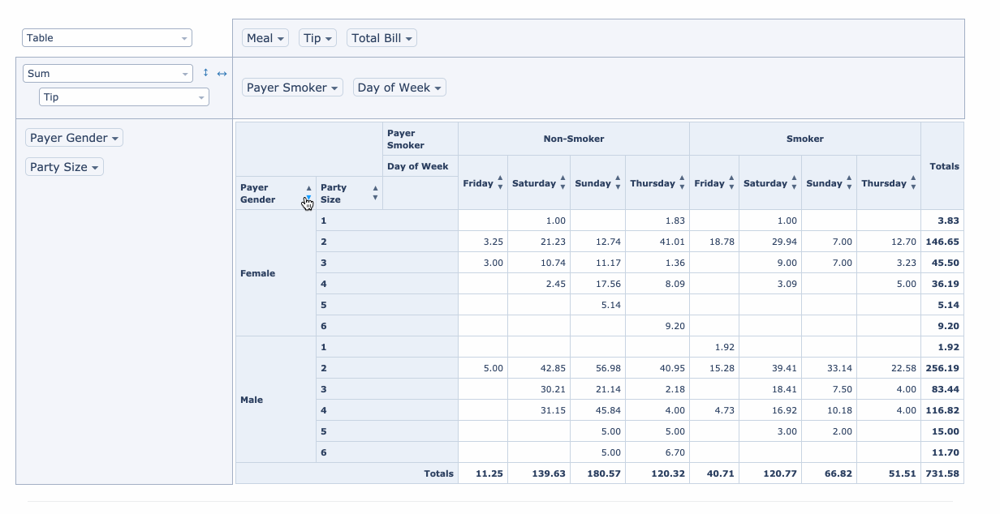

# react-sort-pivottable

## Intro

This repo is forked from [react-pivottable](https://github.com/plotly/react-pivottable#react-pivottable) and has made some improvements. You can refer to original repo to see how to use this component.

Now it has the ability to sort columns and rows. Since it's not like normal tables so from code-side I checked, here's the cols and rows defined:



So the sort function works like this:

- only cols:



- only rows:



- cols and rows:

**Note: In this case, only one dimension works because of the order logic.Row sort will cancel col sort and vice versa**




## How to use

Install it and follow the origin guide

```
npm install react-sort-pivottable
```


It's very easy to enable sort function, it provides two props to let you choose what dimension to apply：

- `enableRowSort`: control row sort
- `enableColSort`: control column sort

You can check the code in `examples/App.jsx` to find the use case, try to toggle the value to see what happens.
